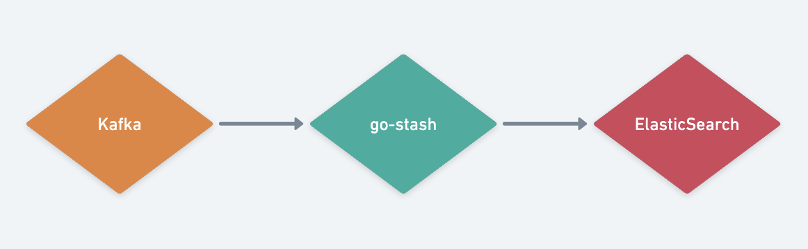

# go-transport简介

go-transport是一个高效的从Kafka获取,根据es的索引配置,然后发送到ElasticSearch集群的工具。  
本项目借鉴了[go-stash](https://github.com/kevwan/go-stash) 项目





### 安装
- 安装环境
```shell
docker-compose up -d
```

### Quick Start


- 可执行文件方式

```shell
cd transport && go build transport.go
./transport -f etc/config.yaml
```


config.yaml示例如下:

```yaml
serviceName: transport
Port: "8081"
Clusters:
  - Input:
      Kafka:
        Name: "kf"
        Brokers:
          - "127.0.0.1:9092"
        Topics:
          - news-data
        Group: news
        Consumers: 16
    Output:
      ElasticSearch:
        Hosts:
          - http://127.0.0.1:9200
        Index: "news_test"

```

## 详细说明

### input

```shell
Conns: 3
Consumers: 10
Processors: 60
MinBytes: 1048576
MaxBytes: 10485760
Offset: first
```
#### Conns
  链接kafka的链接数，链接数依据cpu的核数，一般<= CPU的核数；

#### Consumers
  每个连接数打开的线程数，计算规则为Conns * Consumers，不建议超过分片总数，比如topic分片为30，Conns *Consumers <= 30

#### Processors
  处理数据的线程数量，依据CPU的核数，可以适当增加，建议配置：Conns * Consumers * 2 或 Conns * Consumers * 3，例如：60  或 90

#### MinBytes MaxBytes
  每次从kafka获取数据块的区间大小，默认为1M~10M，网络和IO较好的情况下，可以适当调高

#### Offset
  可选last和false，默认为last，表示从头从kafka开始读取数据


项目

